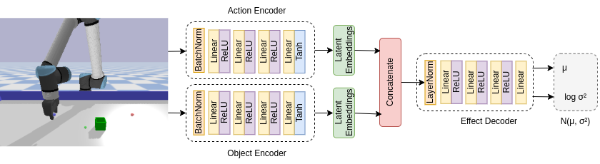
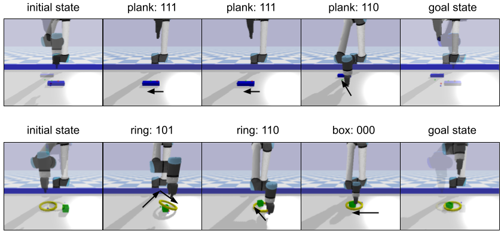

## Predictability-Based Curiosity-Guided Action Symbol Discovery  

  

  

## Abstract  
Discovering symbolic representations for skills is essential for abstract reasoning and efficient planning in robotics. Previous neuro-symbolic robotic studies mostly focused on discovering perceptual symbolic categories given a pre-defined action repertoire and generating plans with given action symbols. A truly developmental robotic system, on the other hand, should be able to discover all the abstractions required for the planning system with minimal human intervention. In this study, we propose a novel system that is designed to discover symbolic action primitives along with perceptual symbols autonomously. Our system is based on an encoder-decoder structure with a bottleneck layer with discrete activation that takes object and action information as input and predicts the generated effect. To efficiently explore the vast continuous action parameter space, we introduce a Curiosity-Based exploration module that selects the most informative actions---the ones that maximize the entropy in the predicted effect distribution. The discovered symbolic action primitives are then used to make plans using a symbolic tree search strategy in single- and double-object manipulation tasks. We compare our model with two baselines that use different exploration strategies in different experiments. The results show that our approach can learn a diverse set of symbolic action primitives, which are effective for generating plans in order to achieve given manipulation goals.

## Citation

```bibtex
@inproceedings{kilic2025predictability,
  author    = {Burcu Kilic and Alper Ahmetoglu and Emre Ugur},
  title     = {Predictability-Based Curiosity-Guided Action Symbol Discovery},
  booktitle = {2025 IEEE International Conference on Development and Learning (ICDL)},
  year      = {2025},
  doi       = {10.1109/ICDL63968.2025.11204386},
  url       = {https://ieeexplore.ieee.org/document/11204386}
}
```

Paper: [IEEE Xplore](https://ieeexplore.ieee.org/document/11204386)  
Video: [Youtube](https://www.youtube.com/watch?v=tJ9Z4o-a4yc)

Data can be found in: https://zenodo.org/records/15968970  
